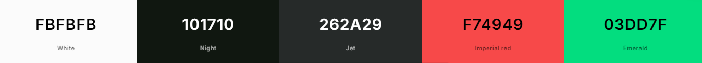

# Projet Synthèse

## 🔗 Lien  

**Repo** : [GitHub - Projet Synthèse](https://github.com/Big-pun/projet-synthese)  

## 📝 Description  

Dans le cadre de la fin de notre programme en développement front-end, nous avons développé un **projet synthèse** en groupe de 4 étudiants. Nous devions utiliser un framework parmi ceux vus en cours (**React, Angular ou Vue.js**). Le backend était fourni.  

Le but était de créer une **application web de gestion de budget** orientée vers les étudiants, en se basant sur les wireframes fournis. L’objectif : proposer un **outil interactif et intuitif** permettant aux utilisateurs de suivre leurs **revenus** et leurs **dépenses** de manière efficace.  

Nous avons choisi **Vue.js**, car c'était le framework avec lequel nous étions le plus à l'aise. Cela nous permettait de mieux nous concentrer sur la gestion du travail en équipe sans complexifier le processus. Vue.js nous offrait aussi une bonne structure (**stores, composants, appels API...**) et une séparation claire des tâches.  

## 🎯 Objectifs  

✔️ **Mener à bien un projet en équipe** en planifiant et répartissant les tâches  
✔️ Gagner en expérience avec le **workflow Git/GitHub en équipe** (branches, PR, gestion des conflits...)  
✔️ Se perfectionner avec **Vue.js et l'API Composition**  
✔️ **Structurer** le code de manière organisée  
✔️ Construire une **SPA** grâce à Vue Router  

## 👥 Équipe  

- **Marie-Pier** [→](https://github.com/marie-pierv)  
- **Ines** [→](https://github.com/ines-taborin)  
- **Adrien** [→](https://github.com/Big-pun)  
- **Jeanne** [→](https://github.com/jeannepietropaoli)  

## 🔄 Répartition des tâches  

Voici la répartition des tâches durant le projet. Nous avons également pu **nous entraider et revoir le code de chacun** tout au long du processus. Pour plus de détails, voir directement les commits des PR ! 🔍  

- 🎨 **Design** (à partir des wireframes) - Jeanne (+ feedback du groupe)  
- 🏠 **Page d’accueil** - Marie-Pier  
- 👤 **Page Profil** - Adrien  
- 📊 **Page Budget** - Jeanne  
- 🔄 **Récupération et gestion des données de l’API** - Ines  
- 🚀 **Header** - Ines  
- 🔚 **Footer** - Marie-Pier  
- 📌 **Sidebar** - Jeanne  

## 🛠️ Technologies utilisées  

- **HTML**  
- **JavaScript**  
- **Vue.js**  
- **CSS**  
- **Tailwind CSS**  

## ⚙️ Outils  

**Gestion de projet** :  
- Trello 📋  

**Communication** :  
- Discord 💬  

**Maquettes** :  
- Figma 🎨  

**Création du logo** :  
- Adobe Illustrator 🖌️  

## 📦 Dépendances  

- **Vite** - Installation et configuration  
- **TailwindCSS** - Librairie de styles  
- **Pinia** - Store et gestion du state  
- **Vue Router** - Navigation  
- **SweetAlert2** - Librairie d’animations pour les alertes  
- **Vuelidate** - Validation des formulaires  
- **Vue Toastification** - Toasts de confirmation  

## 🎨 Design  

### Fonts  

- **Roboto Mono** (h1, texte) → [Voir](https://fonts.google.com/specimen/Roboto+Mono)  
- **Roboto Flex** (h2) → [Voir](https://fonts.google.com/specimen/Roboto+Flex)  
- **Bebas Neue** (h3-6, chiffres) → [Voir](https://fonts.google.com/specimen/Bebas+Neue)  

### Palette de couleurs  

Une **palette sobre et moderne** avec du noir/blanc et deux accents de couleur :  
- **Vert émeraude** pour les aspects positifs ✅  
- **Corail** pour les aspects négatifs ❌  

  

## 🎥 Aperçu  

**Cliquez sur l’image pour voir un aperçu vidéo de l’application !**  

  
